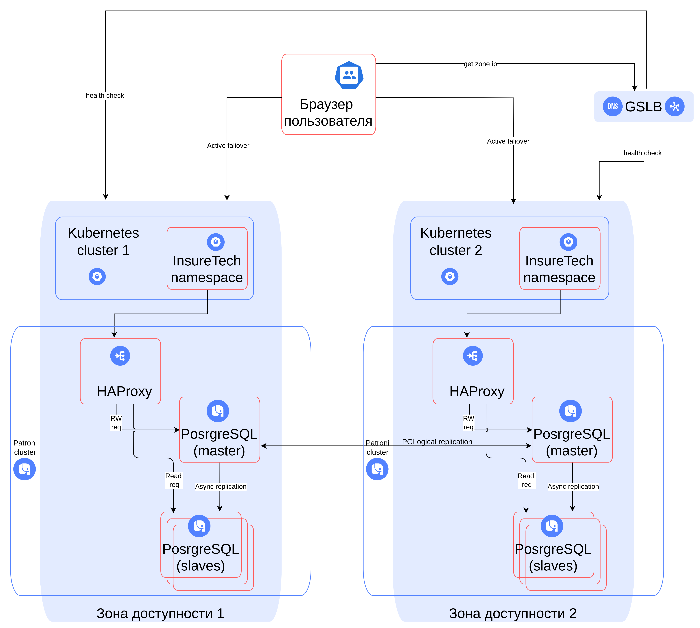

# Задание 1

## Фейловер стратегия

Так как у нас в требованиях явно указано, что необходимо обеспечить одинаковое время загрузки страниц для пользователей 
из разных регионов, то вариант у нас по сути один - `active-active`

## Балансировка

Для балансировки будем использовать Global Server Load Balancing, что бы пользователей перенаправляло к ближайшему 
узлу.

## База данных.

Шардирование использовать не будем, так как не те объёмы. В каждом ЦОД развернём свой Patroni сервер. Между ЦОД будем
использовать логическую репликацию на основе PGLogical.

## Cхема

[Ссылка](InsureTech_технологическая_архитектура-to-be.drawio.xml) на схему.

Та же схема в png-формате:

