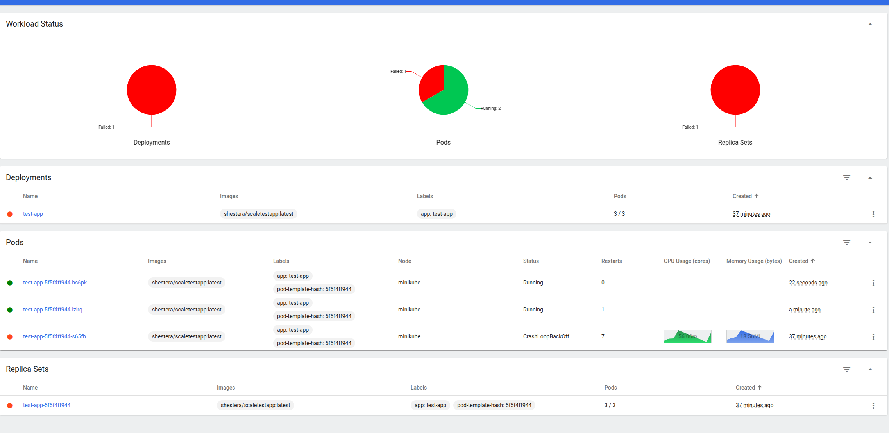

# Задание 2

## Файл deployment.yaml

```yaml
apiVersion: apps/v1
kind: Deployment
metadata:
  name: test-app
  labels:
    app: test-app
spec:
  replicas: 1
  selector:
    matchLabels:
      app: test-app
  template:
    metadata:
      labels:
        app: test-app
    spec:
      containers:
        - name: test-app
          image: shestera/scaletestapp:latest
          resources:
            limits:
              memory: "30Mi"
          ports:
            - containerPort: 8080
```

[Ссылка](deployment.yaml) на файл.

## Файл service.yaml

```yaml
apiVersion: v1
kind: Service
metadata:
  name: test-app-service
spec:
  selector:
    app: test-app
  ports:
    - protocol: TCP
      port: 8080
      targetPort: 8080
  type: NodePort
```

[Ссылка](service.yaml) на файл.

## Файл hpa.yaml

```yaml
apiVersion: autoscaling/v2
kind: HorizontalPodAutoscaler
metadata:
  name: test-app-hpa
spec:
  scaleTargetRef:
    apiVersion: apps/v1
    kind: Deployment
    name: test-app
  minReplicas: 1
  maxReplicas: 10
  metrics:
    - type: Resource
      resource:
        name: memory
        target:
          type: Utilization
          averageUtilization: 50
```

[Ссылка](hpa.yaml) на файл.

## Скриншот дашборада minikube при сработке HPA

Но всё равно ресурсов не хватило, перегрузил кластер =)


