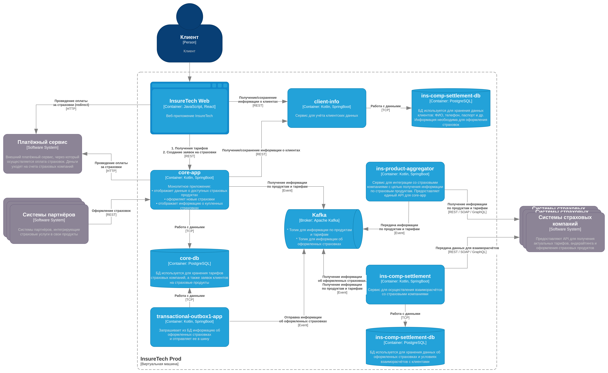

# Задание 3

## Список возможных проблем

* Поскольку запрос к `ins-product-aggregator` синхронный и включает 5 вызовов к API страховых компаний, возникает
проблема "слабого звена": если хотя бы один API отвечает медленно, это замедлит весь исходный запрос;
* Так как планируется ещё увеличить количество страховщиков-партнёров, то эта проблема ещё более усугубляется;
* Данные от страховых компаний "запаздывают", так как информация обновляется по запросу раз в 15 минут/сутки.

## Использование Transactional Outbox

Дополнительно мы можем использовать паттерн `Transactional Outbox` при отправке данных в шину сервисом core-app. 
Всё упрощается тем, что core-app уже использует DB `core-db`, в ней и будем хранить данные для отправки.

## Обновлённая схема

Ссылка на [draw.io](InsureTech_C4_сontainer-diagram.drawio.xml) файл

### Отрендеренная схема
