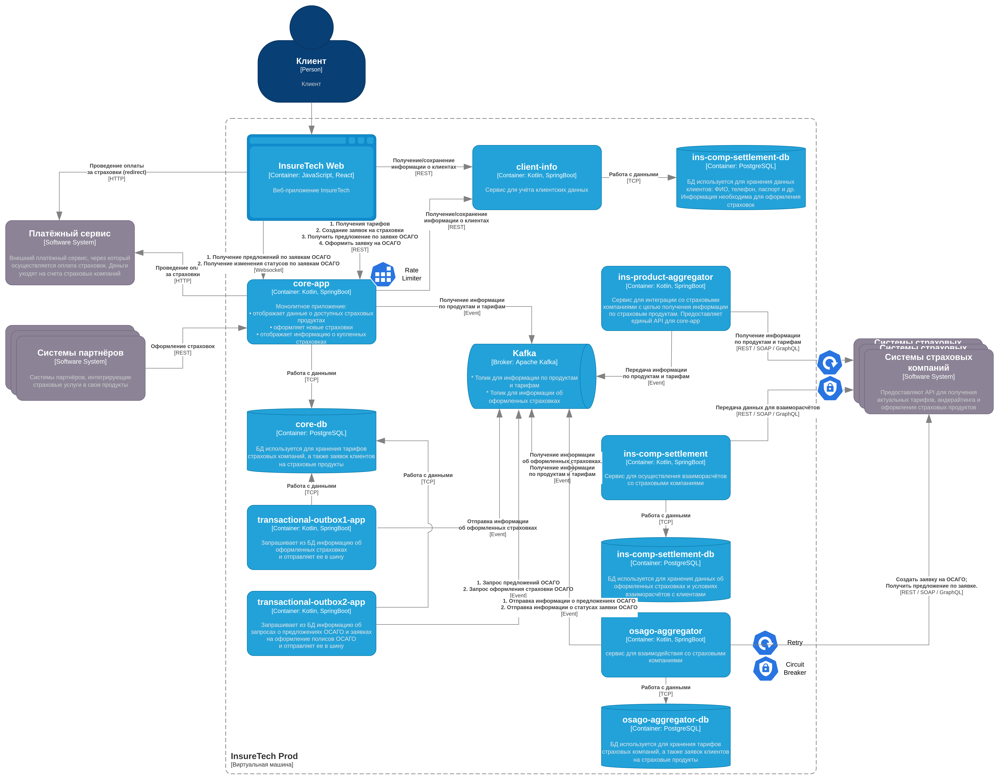

# Задание 4

## Реализация

`core-app` расширим двумя HTTP эндпоинтами: 
* Запрос предложений ОСАГО
* Оформление полиса ОСАГО

Так же научим `core-app` работать с webscket'ом, что бы оперативно получать информацию о предложениях и статусах 
выполнения заявок.

Общаться с новым сервисом будем асинхронно, отправляя и получая сообщения в/из кафки. Отправлять сообщения будем с
помощью дополнительного сервиса, реализующего `transactional outbox`.

Дополнительно для сервисов, общающихся с партнёрами, реализуем паттерны `Retry` и `Circut Breaker`. Для HTTP эндпоинтов
`core-app` реализуем `Rate Limiter`, что бы предотвратить DoS-атаки, намеренные и не очень.

Получившаяся схема в формате [draw.io](InsureTech_C4_сontainer-diagram.drawio.xml)

Она же картинкой:

